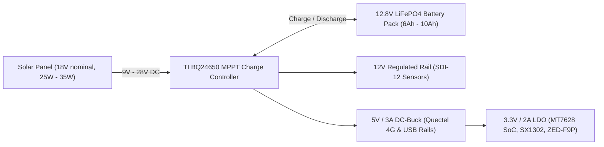

# Complete Engineering & Deployment Guide — Farm Omni Gateway

This guide covers the end-to-end implementation, component pinouts, power design, Linux OpenWrt firmware configuration, and deployment of the **Farm Omni Gateway**.

---

## 🧭 Table of Contents
1. [Hardware Pinout & Interfacing Matrix](#1-hardware-pinout--interfacing-matrix)
2. [Power Architecture & Solar MPPT Design](#2-power-architecture--solar-mppt-design)
3. [OpenWrt 23.05 OS & Kernel Setup](#3-openwrt-2305-os--kernel-setup)
4. [LoRaWAN Concentrator Setup (`chirpstack-concentratord`)](#4-lorawan-concentrator-setup-chirpstack-concentratord)
5. [4G Cellular Backhaul Configuration (`Quectel EC200U`)](#5-4g-cellular-backhaul-configuration-quectel-ec200u)
6. [GPS RTK Base Station Setup (`u-blox ZED-F9P` + NTRIP Caster)](#6-gps-rtk-base-station-setup-u-blox-zed-f9p--ntrip-caster)
7. [Agricultural Weather & Soil Sensor Integration (`SDI-12` & `RS-485`)](#7-agricultural-weather--soil-sensor-integration-sdi-12--rs-485)
8. [Physical Enclosure, RF Layout & Mast Mounting](#8-physical-enclosure-rf-layout--mast-mounting)

---

## 1. Hardware Pinout & Interfacing Matrix

The MediaTek **MT7628AN** SoC exposes all required high-speed and serial communication peripherals:

| Peripheral Bus | SoC Pins / Device | Target Module | Function / Signals |
| :--- | :--- | :--- | :--- |
| **High-Speed SPI** | `SPI_CLK`, `SPI_MOSI`, `SPI_MISO`, `SPI_CS0` (`/dev/spidev0.0`) | **Seeed WM1302 (SX1302)** | LoRa Concentrator data transport (10 MHz clock). |
| **GPIO Reset** | `GPIO11` | **Seeed WM1302** | Hardware reset line for the SX1302 concentrator. |
| **USB 2.0 Host** | `USB_DP`, `USB_DM`, `5V_VBUS` (`/dev/cdc-wdm0`, `ttyUSB*`) | **Quectel EC200U-EU** | LTE Cat 1 bis data connection + AT command channel. |
| **Hardware UART2** | `UART2_RXD`, `UART2_TXD` (`/dev/ttyS2`) | **u-blox ZED-F9P (RTK)** | Binary RTCM3 message stream @ 115200 or 460800 bauds. |
| **Timepulse PPS** | `GPIO39` (External Interrupt) | **u-blox ZED-F9P** | Nanosecond-accurate PPS pulse for NTP microsecond synchronization. |
| **Hardware UART1** | `UART1_RXD`, `UART1_TXD` (`/dev/ttyS1`) | **MAX13487 (RS-485)** | Modbus RTU interface for ultrasonic wind and solar radiation sensors. |
| **Bidirectional Open-Drain** | `GPIO14` (UART Lite / Bitbang) | **SDI-12 Bus (2N7002 MOSFET)** | Multi-depth soil moisture & temperature probes (1200 bauds, 12V bus). |
| **Pulse Counter** | `GPIO18` (Hardware Edge Counter) | **Tipping Bucket Rain Gauge** | Interrupt counter for precipitation measurement (0.2 mm per pulse). |

---

## 2. Power Architecture & Solar MPPT Design

In rural and off-grid agricultural deployments, stable clean power is essential:



### Power Consumption Budget (Nominal Continuous)
- **MT7628AN Linux SoC** (Wi-Fi beaconing, CPU idle/active): ~750 mW
- **SX1302 LoRa Concentrator** (8-channel continuous listening): ~350 mW
- **Quectel EC200U 4G Modem** (Connected idle, periodic MQTT publishing): ~450 mW
- **u-blox ZED-F9P RTK GNSS** (Tracking 32+ satellites, RTCM3 streaming): ~320 mW
- **Isolated Sensors & Bus Transceivers**: ~250 mW
- **Total Power Consumption**: **~2.12 Watts (approx. 175 mA @ 12.8V)**.
- **Battery Autonomy**: A standard 12.8V 8Ah (102 Wh) LiFePO4 battery provides over **48 hours of 100% solar blackout autonomy**.

---

## 3. OpenWrt 23.05 OS & Kernel Setup

### A. Kernel Packages Configuration
When building OpenWrt from source (`make menuconfig`), ensure the following modules are selected for the `ramips/mt7628` target:

```text
# Kernel Drivers & USB
Kernel modules -> USB Support -> kmod-usb-net-qmi-wwan
Kernel modules -> USB Support -> kmod-usb-serial-option
Kernel modules -> SPI Support -> kmod-spi-dev
Kernel modules -> I2C Support -> kmod-i2c-gpio

# Networking & Telemetry Tools
Network -> Telephony -> uqmi
Network -> Telephony -> chat
Network -> Routing and Redirection -> ip-full
Administration -> htop, nano, sqlite3-cli
```

### B. Network Interfaces Configuration (`/etc/config/network`)
Configure the 4G LTE cellular interface as the default WAN route, with the local Wi-Fi operating in Access Point (AP) mode for technician access:

```ini
config interface 'loopback'
	option device 'lo'
	option proto 'static'
	option ipaddr '127.0.0.1'
	option netmask '255.0.0.0'

# Local Technician Wi-Fi Management Interface
config interface 'lan'
	option device 'br-lan'
	option proto 'static'
	option ipaddr '192.168.88.1'
	option netmask '255.255.255.0'

# Cellular 4G LTE QMI Interface (Quectel EC200U)
config interface 'wwan'
	option device '/dev/cdc-wdm0'
	option proto 'qmi'
	option apn 'orange'
	option auth 'none'
	option autoconnect '1'
```

---

## 4. LoRaWAN Concentrator Setup (`chirpstack-concentratord`)

Instead of legacy monolithic packet forwarders, modern edge gateways utilize **ChirpStack Concentratord**:

### A. Concentratord Configuration (`/etc/chirpstack-concentratord/sx1302/concentratord.toml`)

```toml
[concentratord]
log_level="INFO"
stats_interval="30s"

[concentratord.sx1302]
model="seeed_wm1302"
device="/dev/spidev0.0"
reset_pin=11

# Clock frequency and power configurations
clock_source=1
antenna_gain=3

# Multi-channel definitions for Europe / Africa (EU868 standard)
[[concentratord.sx1302.channels]]
frequency=868100000
bandwidth=125000
spread_factor=7

[[concentratord.sx1302.channels]]
frequency=868300000
bandwidth=125000
spread_factor=7

[[concentratord.sx1302.channels]]
frequency=868500000
bandwidth=125000
spread_factor=7

[[concentratord.sx1302.channels]]
frequency=867100000
bandwidth=125000
spread_factor=7

[gateway]
gateway_id="0016c001f0000001"
```

---

## 5. 4G Cellular Backhaul Configuration (`Quectel EC200U`)

The Quectel EC200U supports direct QMI (Qualcomm MSM Interface) or standard ECM/RNDIS networking over USB.

### Automatic Connection Daemon (`/etc/init.d/cellular_watchdog`)
Create a persistent watchdog service to auto-recover cellular connectivity:

```sh
#!/bin/sh /etc/rc.common
START=95

start() {
    echo "Starting Cellular Watchdog..."
    (
        while true; do
            if ! ping -c 2 8.8.8.8 > /dev/null 2>&1; then
                echo "Cellular connection dropped. Reconnecting QMI..."
                uqmi -d /dev/cdc-wdm0 --stop-network 0xffffffff --autoconnect
                sleep 5
                uqmi -d /dev/cdc-wdm0 --start-network orange --autoconnect
            fi
            sleep 60
        done
    ) &
}
```

---

## 6. GPS RTK Base Station Setup (`u-blox ZED-F9P` + NTRIP Caster)

The gateway acts as an authoritative fixed RTK reference base.

### A. Configuring u-blox ZED-F9P in Fixed Base Mode
Using `ubxtool` or u-center, configure the ZED-F9P to output RTCM 3.x messages over its secondary UART port (`UART2` on `/dev/ttyS2`):
- **RTCM 1005**: Stationary RTK reference station ARP with antenna height.
- **RTCM 1074 / 1077**: GPS MSM4/MSM7 pseudorange, carrier phase, Doppler.
- **RTCM 1084 / 1087**: GLONASS MSM4/MSM7 observations.
- **RTCM 1094 / 1097**: Galileo MSM4/MSM7 observations.
- **RTCM 1124 / 1127**: BeiDou MSM4/MSM7 observations.

### B. Streaming RTCM3 via RTKLIB `str2str`
Install `str2str` from the RTKLIB package on OpenWrt and publish to the farm's NTRIP caster:

```bash
# Stream RTCM3 corrections to centralized or local NTRIP Caster
str2str -in serial://ttyS2:115200#rtcm3 \
        -out ntripc://:secretpassword@caster.hey.brad.ag:2101/FARM_BASE#rtcm3 \
        -msg "1005(10),1077(1),1087(1),1097(1),1127(1)" &
```

Autonomous tractors, drone seeders, or field rovers equipped with an RTK rover module subscribe to `http://caster.hey.brad.ag:2101/FARM_BASE` and achieve instantaneous **sub-2 centimeter positioning accuracy** across the entire farm!

---

## 7. Agricultural Weather & Soil Sensor Integration (`SDI-12` & `RS-485`)

### A. RS-485 Modbus RTU Weather Daemon (Ultrasonic Anemometer & Solar Radiation)
Anemometers and pyranometers communicate via RS-485 at 9600 bauds. Run this Python or lightweight C daemon:

```python
#!/usr/bin/env python3
import time
import serial

ser = serial.Serial('/dev/ttyS1', 9600, timeout=1)

def read_weather():
    # Modbus RTU Query: Slave 1, Read Input Registers 0-4 (Wind Speed, Direction, Solar Flux)
    query = bytes([0x01, 0x04, 0x00, 0x00, 0x00, 0x04, 0xF1, 0xC9])
    ser.write(query)
    response = ser.read(13)
    if len(response) >= 13:
        wind_speed = int.from_bytes(response[3:5], 'big') / 100.0  # m/s
        wind_dir = int.from_bytes(response[5:7], 'big')           # degrees
        solar_wm2 = int.from_bytes(response[7:9], 'big')          # W/m²
        return {"wind_speed": wind_speed, "wind_dir": wind_dir, "solar": solar_wm2}
    return None
```

### B. SDI-12 Multi-Depth Soil Moisture Probes
SDI-12 commands follow standard ASCII protocol over `/dev/ttyS0` or bitbanged GPIO:
- Send `0M!` $\rightarrow$ Acknowledged with `00024` (Address 0, measurement ready in 2 seconds, 4 values).
- Wait 2 seconds.
- Send `0D0!` $\rightarrow$ Returns `0+24.5+38.2+41.0+43.5` (Surface temperature 24.5°C, volumetric water content at 10cm, 20cm, 30cm, 40cm depth).

---

## 8. Physical Enclosure, RF Layout & Mast Mounting

```text
========================================================================
                          ANTENNA MAST LAYOUT
========================================================================
                    ▲
                   / \   [ Multi-band RTK GNSS Antenna (L1/L2/L5) ]
                  |   |  Mounted at highest point of mast (clear 360° horizon)
                   \ /
                    |
                    |
                   /|\   [ Ultrasonic Anemometer & Wind Vane ]
                    |
                    |
                 [====]  [ LoRaWAN 868 MHz High-Gain Fiberglass Antenna (N-Type) ]
                    |
                    |
                 +-----+
                 |     | [ Die-cast Aluminum Enclosure IP67 (220x170x90mm) ]
                 |     | - Houses: MT7628 Carrier, WM1302, EC200U, ZED-F9P
                 |     | - Bottom I/O: 4G SMA, LoRa N-type, M12 Weather, Solar
                 +-----+
                    |
                    |--- [ 30W Monocrystalline Solar Panel @ 45° Tilt ]
                    |
                   ===   [ 12V LiFePO4 Battery in Waterproof Base Enclosure ]
========================================================================
```

### Critical Grounding & Surge Protection
1. **RF Lightning Arresters**: Gas discharge tube arresters must be installed on both the LoRaWAN and GNSS coaxial lines and tied to an earth grounding rod.
2. **Thermal Dissipation**: The aluminum enclosure serves as a passive heatsink. Couple the MT7628 SoC and SX1302 concentrator using 2mm silicone thermal pads directly against the metal casing.
