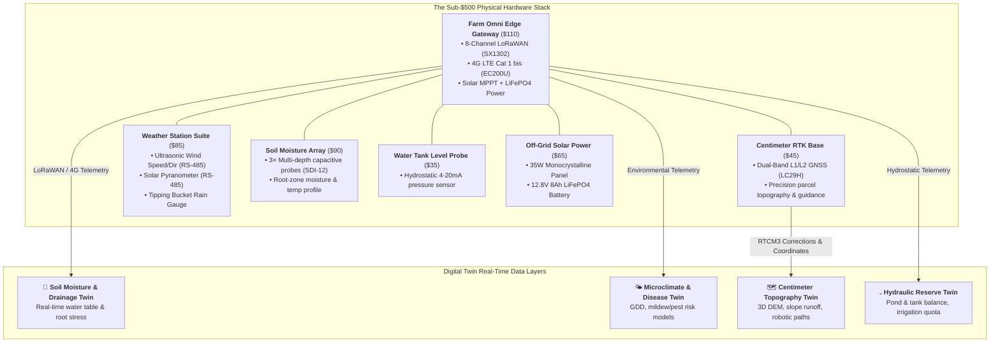

# Farm Omni Gateway — The Sub-$500 Farm Digital Twin

> **The Problem**: How to equip an entire agricultural farm to construct its live, high-fidelity **Digital Twin** for **under $500**?

Proprietary commercial agritech solutions (Campbell Scientific, Davis Instruments, John Deere Field Connect) demand between **$10,000 and $35,000** for basic telemetry, precision guidance, and weather stations, locking farmers into recurring subscription silos.

**Farm Omni Gateway** is an open-source, modular, off-grid edge system that provides the entire physical-to-digital infrastructure required to model, simulate, and monitor a complete farm in real time.

---

## 🎯 The Sub-$500 Farm Digital Twin Architecture

A complete agricultural digital twin requires five physical capabilities:
1. **Soil Dynamics**: Multi-depth root zone volumetric water content, temperature, and electrical conductivity (salinity).
2. **Atmospheric Drivers**: Solar irradiance (photosynthesis potential), wind speed/direction, precipitation, and ambient humidity.
3. **Centimeter Topography & Parcel Geometry**: Centimeter-precision RTK GNSS base station for 3D elevation modeling, slope drainage, and equipment guidance.
4. **Water Resource Levels**: Ultrasonic / hydrostatic irrigation pond and cistern level tracking.
5. **Long-Range Sensor Mesh & Edge Compute**: 8-channel LoRaWAN coverage (10 km radius), 4G LTE backhaul, and local offline data logging.

---

## 💰 The Complete $500 Farm Digital Twin BOM

Here is the exact bill of materials to equip a 50 to 500-hectare farm with all hardware:

| Layer | Component | Function | Estimated Cost |
| :--- | :--- | :--- | :--- |
| **Core Edge Gateway** | MediaTek MT7628 Linux Board (128M/32M, Dual UART, Wi-Fi) | Host processing, local data buffering & OpenWrt | **$8.50** |
| **Long-Range Radio** | Semtech SX1302 / SX1303 8-Channel Concentrator (WM1302) | Listens to hundreds of field nodes over 10 km | **$28.00** |
| **Cellular Backhaul** | Quectel EC200U-EU (LTE Cat 1 bis) | Global 4G connectivity with standard SIM | **$8.00** |
| **Precision Topography**| Quectel LC29H (Dual-band L1/L5 RTK GNSS) + Multi-band Antenna | Centimeter RTK Base Station for 3D field elevation | **$45.00** |
| **Micro-Climate Suite** | RS-485 Ultrasonic Anemometer + Solar Radiation Pyranometer | Ambient temperature, humidity, wind & solar flux | **$85.00** |
| **Rainfall Tracking** | Tipping Bucket Rain Gauge (0.2 mm resolution) | Direct precipitation counter via hardware interrupt | **$22.00** |
| **Soil Profile Probes** | 3× Multi-depth capacitive soil moisture/temperature probes | Root-zone volumetric water content (SDI-12) | **$90.00** |
| **Field Bus Drivers** | Isolated RS-485 (MAX13487) + SDI-12 bidir level-shifter | Industrial noise-immune field communications | **$6.00** |
| **Solar Power Subsystem**| 35W Monocrystalline Panel + 12V 8Ah LiFePO4 Battery + MPPT | 100% off-grid autonomy (3+ days solar blackout) | **$65.00** |
| **Rugged Housing** | Die-cast Aluminum Enclosure IP67 + Waterproof Cable Glands | Mast-mountable, UV & extreme weather resistant | **$18.00** |
| **RF Cabling & Masts** | Coaxial pigtails, SMA/N-Type connectors, lightning arresters | Clean RF installation | **$14.00** |
| **TOTAL FARM BOM** | **Complete Live Farm Digital Twin Hardware Infrastructure** | | **$389.50** |

> 💡 **Result**: For **under $400 in hardware** (leaving $100 buffer for mounting brackets and cables), the farm possesses an edge infrastructure that rivals commercial telemetry packages costing upwards of $15,000.

---

## 🌟 What the Sub-$500 Farm Digital Twin Delivers

1. **Autonomous Irrigation Optimization**:
   - Compares real-time soil water tension at 15cm, 30cm, and 60cm depths against daily evapo-transpiration (ET0) calculated from the gateway's solar pyranometer and wind speed.
2. **Centimeter Precision Guidance & Elevation Model (DEM)**:
   - The integrated RTK base broadcasts standard RTCM 3.x corrections over local radio or cellular NTRIP caster. Tractors and drones achieve **sub-2 centimeter accuracy** without recurring satellite correction subscriptions ($2,500/yr saved per tractor).
3. **Local-First & Offline Resilience**:
   - The gateway runs a local LoRaWAN Network Server (`chirpstack-concentratord`) and an embedded SQLite time-series database. If cellular coverage drops for weeks, telemetry continues to be recorded on-site without data loss.
4. **Direct Technician Wi-Fi Portal**:
   - Integrated 802.11n Wi-Fi allows farm operators to inspect sensor health and view live parcel dashboards directly on their smartphones while standing at the base of the mast.

---

## 📚 Technical Implementation & Schematics

- 👉 [**HOWTO.md**](./HOWTO.md) — Complete step-by-step engineering, pinouts, OpenWrt build, and deployment guide.
- 👉 [**Milestones Roadmap**](./docs/milestones/README.md) — The 6 progressive milestones from benchtop prototype to off-grid solar deployment.
- 👉 [**License Audit Matrix**](./docs/compliance/LICENSE_AUDIT.md) — Living BOM open-source compliance matrix (Zero Proprietary Blobs).
- 👉 [**AGENTS.md**](./AGENTS.md) — LLM agent standards and 3-tier contribution protocol.

---

## 📄 Multi-Tier Licensing Architecture

To ensure complete legal rigor, avoid GPL-v2/v3 kernel boundary conflicts, and protect open hardware designs, this repository employs a **Layered Multi-Licensing Model**:

| Subdirectory | Domain | License | SPDX |
| :--- | :--- | :--- | :--- |
| [**`hardware/`**](./hardware/) | Schematics, PCB layout, BOM, mechanical CAD | **CERN-OHL-S v2** | `CERN-OHL-S-2.0` |
| [**`os/`**](./os/) | Kernel patches, device trees (DTS), OpenWrt configs | **GNU GPL v2.0** | `GPL-2.0-only` |
| [**`software/`**](./software/) | Applications, daemons, captive portal, twin models | **GNU Affero GPL v3.0** | `AGPL-3.0-or-later` |

See the master [**LICENSE**](./LICENSE) file for the complete multi-tier declaration.
