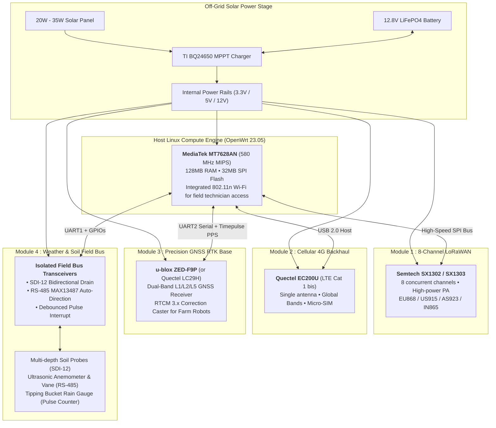

# Farm Omni Gateway (`farm-omni-gw`)

**Farm Omni Gateway** is an open-source, modular, ultra-frugal, off-grid IoT Edge Gateway engineered for precision agriculture (**Hey Brad**) and remote aquaculture (**fshry**).

Commercial outdoor gateways (such as the Dragino DLOS8N at $300+) are costly, closed, and limited to basic packet forwarding. **Farm Omni Gateway** delivers an all-in-one outdoor edge hub for **sub-$100 BOM**, combining:
1. **8-Channel LoRaWAN Concentrator** (`SX1302`/`SX1303`).
2. **Resilient 4G LTE Cat 1 bis Backhaul** (`Quectel EC200U`).
3. **High-Precision GNSS RTK Base Station** (`u-blox ZED-F9P` or `Quectel LC29H`) broadcasting RTCM3 corrections to autonomous tractors, drone seeders, and robotic field equipment.
4. **Isolated Agricultural Field Bus Interfaces** (`SDI-12` soil probes, `RS-485 Modbus RTU` weather sensors, and rain gauge pulse counter).
5. **Integrated Solar MPPT Power Management** for 12V LiFePO4 batteries (< 2.2W total system consumption).

---

## 🏗️ System Architecture

---

## 💰 Bill of Materials (BOM) Comparison

| Sub-System | Farm Omni Gateway Component | Unit Cost (Batch 50 pcs) | Dragino DLOS8N |
| :--- | :--- | :--- | :--- |
| **Host Compute Engine** | MediaTek MT7628AN Core Board (128M/32M, Wi-Fi, USB, Dual UART) | **$8.50** | Atheros AR9331 (Obsolete) |
| **LoRaWAN Concentrator** | Semtech SX1302 / SX1303 (Seeed WM1302 Mini-PCIe SPI) | **$28.00** | SX1302 Module |
| **4G Cellular Backhaul** | Quectel EC200U-EU (LTE Cat 1 bis, Single RF, SIM slot) | **$8.00** | Quectel EC25 ($25+) |
| **Field Bus & Weather** | MAX13487 (RS-485) + 2N7002 (SDI-12) + Pulse RC filter | **$4.00** | *Not available* |
| **Solar MPPT Power Stage** | TI BQ24650 circuit + 9-28V DC Buck rails | **$5.50** | *Basic 12V input only* |
| **IP67 Enclosure & RF Ports** | Cast Aluminum Enclosure + SMA / N-Type Waterproof Connectors | **$16.00** | Plastic Enclosure |
| **Base Gateway Total** | **LoRaWAN 8-Ch + 4G + Weather/SDI-12 + Solar MPPT** | **~$70.00** | **$290.00 - $350.00** |
| **Optional RTK Base Module** | Quectel LC29H ($35) or u-blox ZED-F9P ($110) | **+$35.00 to +$110.00** | *Not available* |
| **All-In-One RTK Edge Total**| **LoRaWAN + 4G + Weather + Centimeter RTK Base Station** | **~$105.00 to ~$180.00** | *Requires $2,000+ Trimble/Leica Base* |

---

## 🌟 Key Features

- **Quad-Capability Architecture**: Combines telemetry collection, weather monitoring, and robotic guidance into a single mast-mounted unit.
- **Local ChirpStack Edge Engine**: Runs a standalone LoRaWAN Network Server locally. Even when 4G is down for weeks, all field data is cached in SQLite and processed on-site.
- **Wi-Fi Maintenance Portal**: Agronomists and farm technicians connect directly via smartphone Wi-Fi at the base of the mast to diagnose sensors or view live plots without opening the sealed enclosure.
- **Centimeter-Grade RTK Correction Caster**: Streams RTCM3 corrections over local Wi-Fi, LoRa, or cellular NTRIP caster (`caster.hey.brad.ag:2101`) to guide autonomous tractors within a 15 km radius.
- **100% Autonomous Solar Operation**: Consumes only ~2.2W in nominal continuous operation; a compact 30W solar panel and a 12V 8Ah LiFePO4 battery provide indefinite off-grid autonomy.

---

## 📚 Documentation & Guides

- 👉 [**HOWTO.md**](./HOWTO.md) — Complete step-by-step engineering, pinouts, OpenWrt build, and deployment guide.
- 👉 [**AGENTS.md**](./AGENTS.md) — LLM agent standards and 3-tier contribution protocol.

---

## 📄 License

This project is licensed under the **GNU Affero General Public License v3.0 (AGPL-3.0)**. See the [LICENSE](./LICENSE) file for details.
